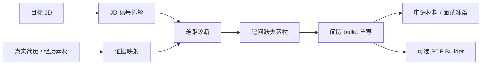

# Easy-Job-Tutor

## JD 驱动的求职材料优化 Skill

> 基于目标 JD 和真实经历，诊断岗位差距、追问遗漏素材、重写简历 bullet，并在需要时生成 ATS 可读、HR 易判断、面试可自洽的求职材料。


[English](docs/readme/README.en.md) · [Français](docs/readme/README.fr.md) · [日本語](docs/readme/README.ja.md) · [Español](docs/readme/README.es.md) · [Deutsch](docs/readme/README.de.md) · [30 秒开始](#30-秒开始) · [安装指南](#安装指南) · [生成示例-pdf](#生成示例-pdf)

**本项目帮助提高简历表达质量和岗位匹配度，但不保证通过 ATS、获得面试或录用。**

`resume` · `cv` · `job-search` · `jd-analysis` · `ats` · `prompt-engineering` · `codex-skill` · `pdf-resume`

## 适用人群

| 你是谁 | 这个 Skill 能帮什么 |
| --- | --- |
| 应届生 / 实习生 | 从课程、实习、竞赛和项目中挖掘岗位相关证据，写出更像真实候选人的简历 |
| 社招求职者 | 把职责描述重构为可验证的业务贡献，减少空泛、模板化表达 |
| 转码 / 转岗候选人 | 找出 JD 和现有经历之间的证据缺口，明确哪些素材需要补充 |
| 简历反复改不动的人 | 用结构化问题拆解经历，避免只改措辞、不改信息密度 |
| 使用 Codex 管理求职材料的人 | 把 JD 分析、简历改写、申请邮件、面试准备和 PDF 交付放进同一套 workflow |

## 它能做什么

- **JD 分析**：提取职责、硬技能、软技能、关键词、资历信号和隐性筛选条件。
- **匹配度诊断**：把目标岗位要求映射到用户真实经历，指出强证据、弱证据和缺口。
- **素材追问**：针对缺口追问项目背景、工具、规模、指标、协作对象和结果，避免编造。
- **简历优化**：按 action、method/tool、scope、impact 重写 bullet points。
- **申请材料**：生成申请邮件、Cover Letter、内推 / LinkedIn 私信。
- **面试准备**：把简历内容转成可讲述、可追问、可自洽的面试答案框架。
- **PDF 交付**：在用户明确要求时，把优化后的内容排成 ATS 友好的文本型 PDF。

## 工作流



## Resume PDF Builder

PDF Builder 只负责最后的视觉交付，不替代前面的 JD 策略和真实性校验。

它会把已经优化好的简历内容渲染成一份更接近 [VibeResume](https://github.com/LiuMengxuan04/vibe-resume) 审美的 HTML-to-PDF 页面：

- 固定白色简历画布，浏览器预览和 PDF 导出尽量一致。
- 顶部 profile block 展示姓名、目标方向和联系方式。
- contact chips、section divider、timeline-like entry、skills panel 提升扫描效率。
- 仍然保持文本可选择、可复制、可被 ATS 解析。
- 默认不添加照片；如果需要照片，只使用用户上传的正式正面照。

支持三种风格：

| 风格 | 适用方向 |
| --- | --- |
| `Classic Professional` | 金融、咨询、法律、政府、教育、传统企业、行政、会计、审计 |
| `Modern Minimal` | 默认风格；科技、数据、AI、软件工程、产品、商业分析、创业公司和互联网岗位 |
| `Creative Clean` | 市场、内容、媒体、品牌、设计相关和创作者岗位 |

## Skill Preview


## 安装指南

```bash
python3 -m venv .venv
.venv/bin/python -m pip install -r requirements.txt
.venv/bin/python -m playwright install chromium
```

安装为本地 Codex Skill：

```bash
cp -R Easy-Job-Tutor ~/.codex/skills/easy-job-tutor
```

## 30 秒开始

把目标 JD 和你的现有简历发给 Codex，然后这样说：

```text
请使用 Easy-Job-Tutor，先分析这个 JD，再基于我的真实经历优化中文简历。
不要编造经历；如果缺少关键素材，先追问我。
```

## 生成示例 PDF

如果已经有优化后的结构化简历内容，可以直接生成 PDF：

```bash
.venv/bin/python scripts/build_resume_pdf.py \
  --input examples/sample-resume.json \
  --output outputs/resume.pdf \
  --html outputs/resume.html \
  --style modern-minimal \
  --page-size A4
```

校验生成的 PDF：

```bash
.venv/bin/python scripts/verify_resume_pdf.py \
  --pdf outputs/resume.pdf \
  --html outputs/resume.html
```

## 项目结构

```text
Easy-Job-Tutor/
├── SKILL.md
├── templates/
├── design/
├── scripts/
├── examples/
├── tests/
├── assets/readme/
└── docs/readme/
```

## 质量原则

- 不编造学历、公司、项目、指标、奖项或时间线。
- 没有证据的内容先追问，不直接写进简历。
- 优先让 HR 能快速判断岗位匹配度，而不是堆关键词。
- PDF 必须是文本型输出，不把整份简历导出成图片。
- 示例和回复中不创建假的下载链接。

## License

MIT
