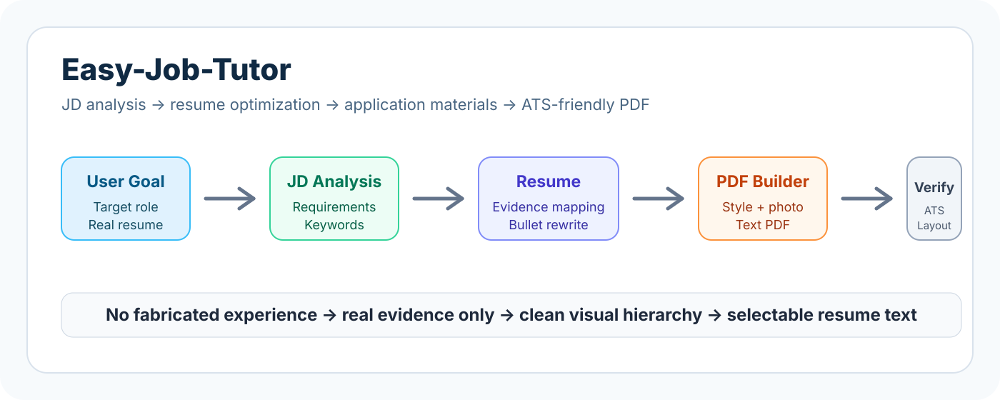
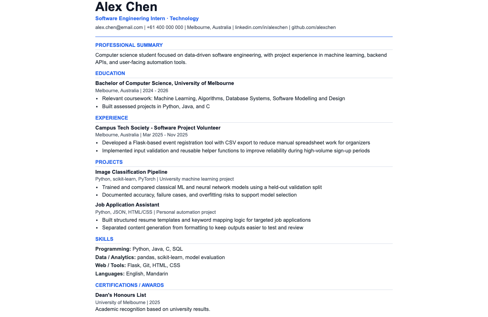

# Easy-Job-Tutor

[Retour au choix de langue](../../README.md)

## Skill Preview





## Fonctionnalités

Easy-Job-Tutor est un Skill Codex open source pour l'analyse d'offres d'emploi, l'optimisation de CV, les documents de candidature, la préparation aux entretiens et la génération facultative de CV PDF compatibles ATS.

Il aide les utilisateurs à transformer un poste cible et leur expérience réelle en meilleurs supports de candidature.

Il peut :

- Analyser une offre d'emploi et extraire les exigences du poste.
- Évaluer l'adéquation d'un CV avec une offre cible.
- Réécrire les points du CV à partir d'expériences réelles uniquement.
- Rédiger des e-mails de candidature, lettres de motivation et messages de recommandation.
- Préparer des questions d'entretien et des cadres de réponse.
- Générer un CV PDF propre et textuel lorsque l'utilisateur le demande explicitement.

## Resume PDF Builder

Le Resume PDF Builder transforme un contenu de CV optimisé en PDF professionnel et facile à lire pour les recruteurs.

Styles pris en charge :

- `Classic Professional` : finance, conseil, droit, gouvernement, éducation, grandes entreprises, administration, comptabilité et audit.
- `Modern Minimal` : style par défaut, pour technologie, data, IA, software engineering, produit, business analysis, startups et internet.
- `Creative Clean` : marketing, contenu, médias, marque, design adjacent et rôles créatifs.

Photo :

- Aucune photo par défaut.
- Si l'utilisateur souhaite une photo, il doit fournir une image claire, formelle et de face.
- Seules les photos fournies par l'utilisateur sont utilisées, et le texte du CV reste sélectionnable.

## Installation

```bash
python3 -m venv .venv
.venv/bin/python -m pip install -r requirements.txt
.venv/bin/python -m playwright install chromium
```

Installer comme Skill Codex local :

```bash
cp -R Easy-Job-Tutor ~/.codex/skills/easy-job-tutor
```

## Générer un PDF d'exemple

```bash
.venv/bin/python scripts/build_resume_pdf.py \
  --input examples/sample-resume.json \
  --output outputs/resume.pdf \
  --html outputs/resume.html \
  --style modern-minimal \
  --page-size A4
```

Vérifier le PDF généré :

```bash
.venv/bin/python scripts/verify_resume_pdf.py \
  --pdf outputs/resume.pdf \
  --html outputs/resume.html
```

## Principes de qualité

- Ne pas inventer de contenu de CV.
- Préférer les PDF textuels compatibles ATS.
- Éviter les décorations excessives, tableaux complexes, barres de compétences et CV entièrement en image.
- Vérifier la mise en page avant d'utiliser le PDF final.
- Ne pas créer de faux liens de téléchargement.

## Licence

MIT
